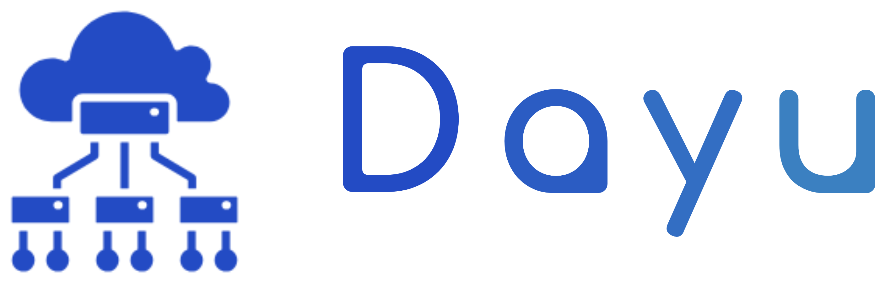
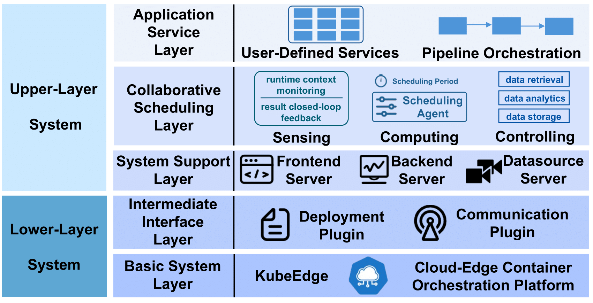
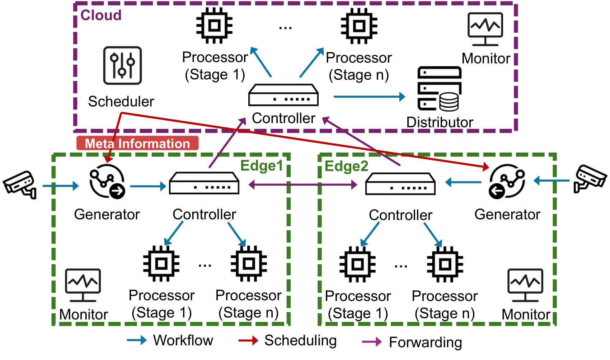

简体中文 | [English](./README.md)

# 大禹 Dayu

## 简介

大禹是一款用于边缘计算中的流数据处理自适应调度系统，大禹系统支持多数据流的流水线服务处理，并专注于边缘计算中的调度策略。它基于 KubeEdge 开发，可以在不同平台之间轻松迁移。

## 相关框架
- [Docker Container](https://github.com/docker/docker-ce)
- [Kubernetes](https://github.com/kubernetes/kubernetes)
- [KubeEdge](https://github.com/kubeedge/kubeedge)
- [Sedna](https://github.com/kubeedge/sedna)
- [EdgeMesh](https://github.com/kubeedge/edgemesh)
- [TensorRT](https://github.com/NVIDIA/TensorRT)

## 架构

大禹由五个层次组成：

- **基础系统层**：该层采用 `KubeEdge` 架构，部署在云边环境的所有分布式节点上。`KubeEdge` 是华为为边缘场景提出的 `Kubernetes` 扩展，能很好地部署在资源有限、性能低下的设备上。
- **中间接口层**：通过修改和扩展官方接口组件 `Sedna` 和通信组件 `Edgemesh`，提供定制化服务安装和组件通信。
- **系统支持层**：为用户提供交互式界面（前端）、自动安装（后端）和模拟数据源（数据源）。
- **协同调度层**：由我们自主开发的功能组件组成，完成流水线任务执行和调度协作等功能。
- **应用服务层**：接收用户定义的服务应用。只要用户根据平台定义的接口需求开发服务，就可以以容器形式嵌入平台并完成云边节点之间的执行。

### 基础系统层与中间接口层

- **基础系统层** 
  - `KubeEdge` 使用 CloudCore 和 EdgeCore 实现云边环境中的容器化应用编排和设备管理。
- **中间接口层** 
  - `Sedna` 使用全局管理器（GM）和本地控制器（LC）实现云边协同应用。根据平台的部署需求，我们修改了 `Sedna` 中 GM 和 LC 的 CRD 控制器（[链接](https://github.com/dayu-autostreamer/dayu-sedna)）。
  - `Edgemesh` 为系统中的 Pod 间通信提供高效方式。根据大禹的需求，我们修改了 `Edgemesh` 的负载均衡策略（[链接](https://github.com/dayu-autostreamer/dayu-edgemesh)）。

*注意：为便于理解与区分，我们将 `Sedna` 的 "本地控制器（Local Controller）" 转换为结构中的 "本地管理器（Local Manager）"。*

### 系统支持层

系统支持层由 **backend**、**frontend** 和 **datasource** 组成。

- `frontend`：使用 vue 提供图形化用户界面（以网页形式）。
- `backend`：与前端交互，提供必要数据，并根据前端指令自动安装组件。
- `datasource`：提供模拟数据源，扮演数据来源角色（如摄像头）。

### 协同调度层与应用服务层

协同调度层和应用服务层的组件作为中间接口层的 Worker，提供具体的功能服务。

- `generator`：绑定到数据流并根据调度器的调度策略完成数据包分段。
- `controller`：控制云边设备之间数据处理和转发的全过程。
- `processor`：使用 AI 算法处理数据，服务流水线可能包含多个阶段的处理器。
- `distributor`：收集多数据流的处理结果和处理信息，并根据不同需求进行分发。
- `scheduler`：根据资源状态和任务状态生成调度策略，调度策略包括任务卸载和数据配置。
- `monitor`：监控资源使用情况，例如 CPU 使用率、内存使用率和网络带宽。

在这些组件中，`generator`、`controller`、`distributor`、`scheduler` 和 `monitor` 嵌入平台以提供精细的流水线任务组织和调度，它们对用户不可见。

同时，`processor` 可以封装用户定义的单阶段或多阶段（流水线）的应用服务，构成应用服务层。

## 特性

- **将应用服务变为无状态微服务**：平台上的用户应用服务以无状态微服务形式运行。服务与数据流状态和系统状态无关，由框架自动部署到容器中，无需节点环境依赖。
- **兼容异构节点**：平台兼容不同硬件架构（如 x86/arm64）、不同性能配置和资源配置的分布式节点，适应节点间不同的物理距离和通信质量。
- **支持细粒度实时调度**：平台根据工作条件和资源情况实时生成任务数据配置和任务卸载决策，从而完成任务的细粒度实时调度。
- **支持多数据流的并行处理**：平台支持多数据流的并行处理（例如，不同路口的摄像头同时处理交通流量任务），这些任务在处理阶段不区分数据流，等效处理。

## 使用

请参照我们的[快速开始教程](https://dayu-autostreamer.github.io/docs/getting-started/)来快速尝试大禹系统。

如果你需要进一步开发大禹系统来适应你的需求，请参照我们的[开发教程](https://dayu-autostreamer.github.io/docs/developer-guide/)。

要获取关于大禹系统的详细说明，请参阅[项目主页](https://dayu-autostreamer.github.io/)上的文档。

## 联系我们

如果有任何问题，请随时通过以下方式联系我们：

- [Lei Xie](mailto:lxie@nju.edu.cn)

- [Wenhui Zhou](mailto:whzhou@smail.nju.edu.cn)

## 贡献

如果您有兴趣成为贡献者并希望参与大禹系统代码的开发，请参阅[CONTRIBUTING](CONTRIBUTING.md)，了解提交补丁和贡献流程的详细信息。

## 许可证

大禹系统遵循Apache 2.0许可证,请参阅[LICENSE](LICENSE)以获取详细信息。

